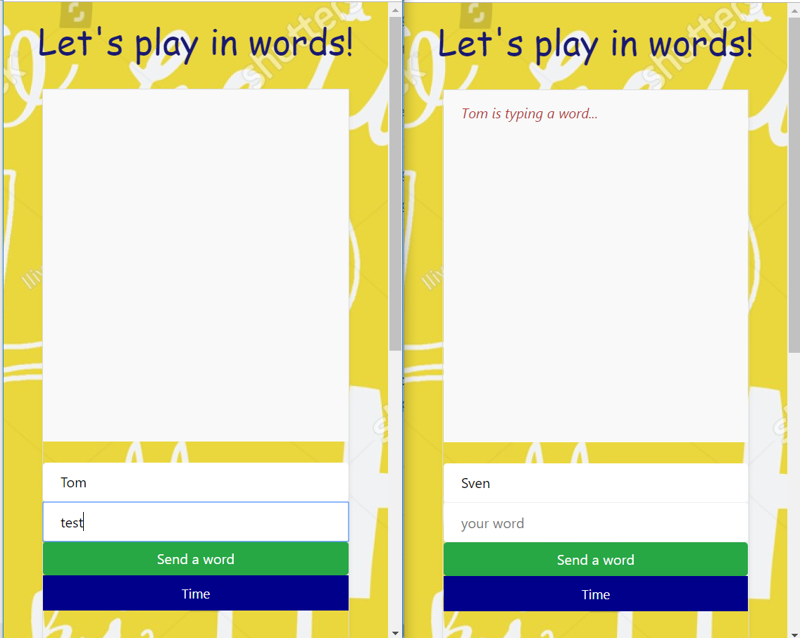
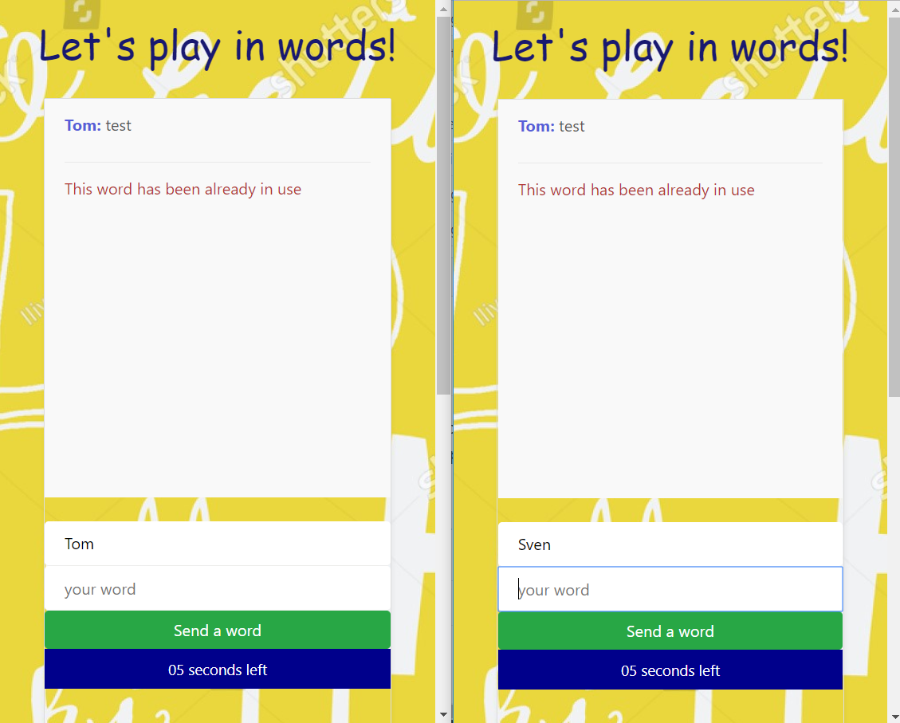
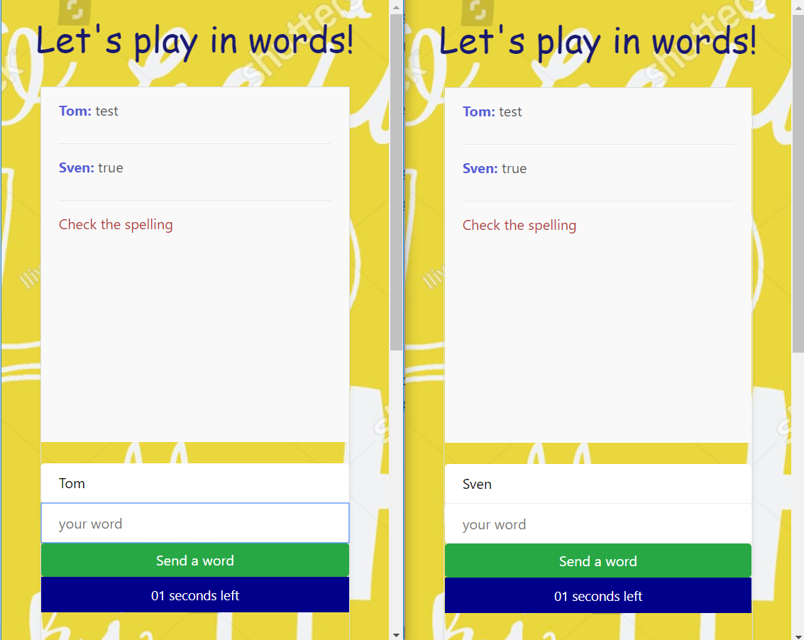
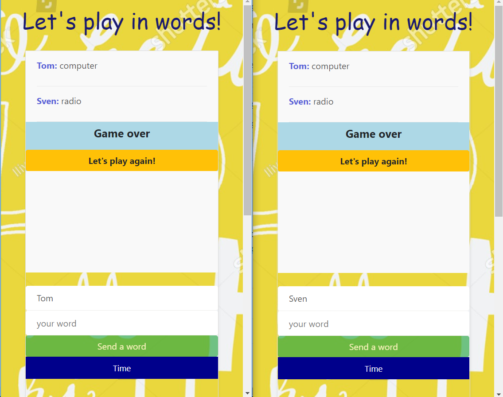

# socket-io-words-game
Words game created with using of socket.io
Ideal for two players, but also suitable for 1 and more.
Start with any real English word. Next word should start with the last letter of previous one.
Same words are not allowed. Only 10 seconds to find the correct word.

Live version: https://calm-thicket-99664.herokuapp.com/

<h3>Starting a game with 2 players</h3>

  

<h3>If a player is sending a word already being in use (timer comtinues to count down)</h3>

  

<h3>If spelling is not correct (timer comtinues to count down)</h3>

  

<h3>If the first letter doesn't correspond to the last letter of previos word (timer comtinues to count down)</h3>

  

<h3>Time over - game over</h3>

  

